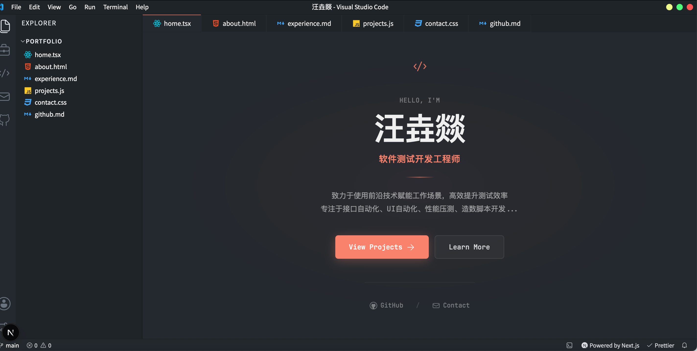
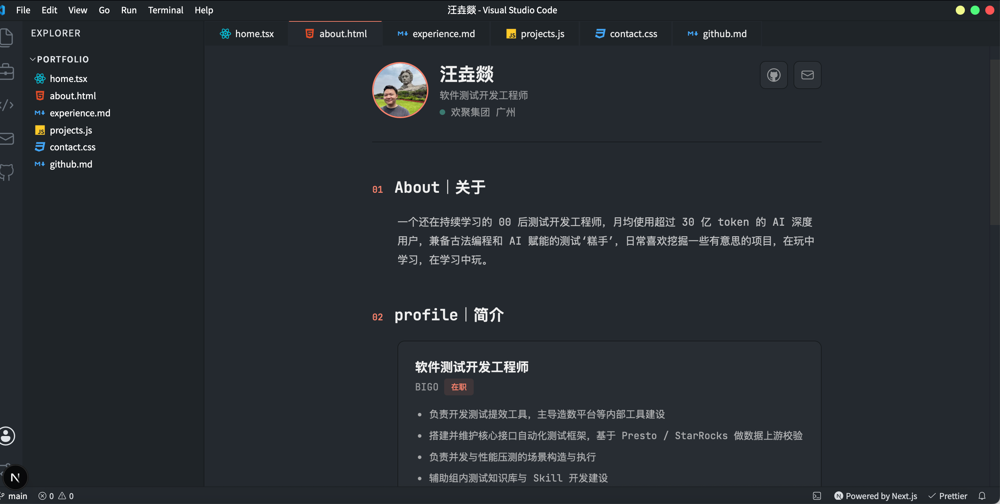

# VisualStudioPortfolio

> 把个人作品集，装进一个 Visual Studio Code 里。

这是一个个人作品集网站，使用 Visual Studio Code 的创意风格来呈现：左边是资源管理器，顶上是标签页，中间是「编辑器」，底下还藏着一个真的能敲的终端。外壳是熟悉的 VS Code，里面装的是我自己的经历、项目和联系方式。

## 预览





## 六个文件，六个页面

导航本身就是界面的一部分——点开哪个「文件」，就进入哪个页面。

| 标签页 | 页面 | 内容 |
| --- | --- | --- |
| `home.tsx` | 首页 | 一句话介绍与主旨引导 |
| `about.html` | 关于 | 个人基础信息、简介、技能、Github 与日常 |
| `experience.md` | 经历 | 工作履历，卡片列表 + 详情弹窗 |
| `projects.js` | 项目 | 手搓过的实际工程项目 |
| `contact.css` | 联系 | 邮件、GitHub、微信、QQ |
| `github.md` | GitHub | 实时拉取账号数据、贡献图与最近仓库 |

## 特点

- **内容与样式分离**：所有个人内容集中在 `data/` 目录，改文案不用碰页面组件和 CSS
- **经历页正文可自由编排**：`Overview` / `Responsibilities` / `Impact` / `Stack` 只是默认示例，分块数量、标题、类型（段落 / 列表 / 标签）都可以自己配，甚至可以只保留两块
- **交互式终端**：支持 `help`、`experience`、`projects`、`theme`、`ls` 等命令
- **命令面板**：`Ctrl/Cmd + Shift + P` 唤起，`G` 系列和弦快捷键直接跳页
- **多套主题**：GitHub Dark、Dracula、Ayu、Nord、Night Owl
- **GitHub 页实时数据**：头像、仓库数、贡献图与最近仓库都来自 GitHub API

## 快速开始

```bash
npm install
npm run dev      # 本地开发，默认 http://localhost:3000
npm run build    # 生产构建
npm test         # 运行测试
```

## 换成你自己的内容

个人内容全部集中在 `data/` 目录，不需要改动页面组件：

| 文件 | 作用 |
| --- | --- |
| `data/profile.ts` | 姓名、职位、简介、技能、联系方式、终端文案、SEO 信息 |
| `data/experiences.ts` | 工作经历：公司、职位、时间、地点、卡片摘要与详情分块 |
| `data/projects.ts` | 项目列表：名称、简介、链接与图标 |

如果希望 GitHub 页展示你自己的账号，在 `.env.local` 里设置 `NEXT_PUBLIC_GITHUB_USERNAME`（该变量优先于 `data/profile.ts` 中的 `links.githubUsername`）。

## 技术栈

Next.js 16（App Router）· React 19 · TypeScript · CSS Modules · Vitest

## 致谢

界面创意与初始设计来自 [itsnitinr/vscode-portfolio](https://github.com/itsnitinr/vscode-portfolio)（MIT License），本项目在其基础上做了大量的界面与内容改造。

## License

[MIT](LICENSE)
